# I. Project Overview: Guardrails
This project is about automate feature order and search for web site: https://juice-shop.guardrails.ai/

# II. Folder structure
We will go through some structure in the project, after that, you will know where to find the specific file and where you can edit the file.

## 1. Folders Overview
Under the root folder "GuardRails", you will see some main folders like below:
+ cypress/e2e: contains all test cases.

+ cypress/pages: contains page object model

+ cypress/support: this folder contains step definition which is used for creating test case.

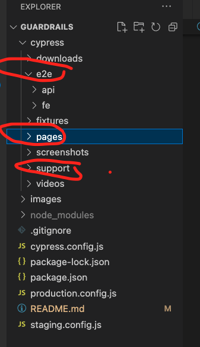

## 2. Folder - e2e
This is folder which contains all test cases. under this folder we have 2 folders:
+ api: contains test case for api (api test).
+ fe: contains test case for front end test (ui test).

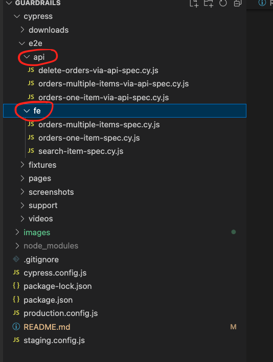

## 3. Folder - pages
This folder contains page object model.

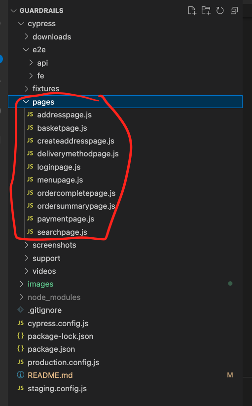

## 4. Folder - support
contains step definition (command) for creating test case.

+ support/api: related to command used for api test case.

+ support/fe: related to command used for fe (ui) test case.

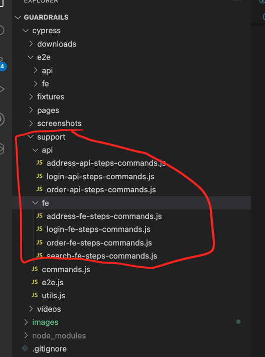

# III. Setting Environment for running test case.
To be able to run on multiple env: staging or production (example). we need to create some configuration file. Then later when we run the test case we have to specify which env we want to test.

There are 2 current env
+ staging: /guardraids/staging.config.js
+ production.config.js

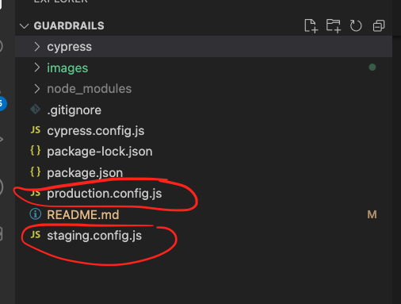

These files has same param, the only the thing different is value. for example the base_url on staging will be different base_url on production.

You can change your base url , your email and password and uri api for testing in different env.
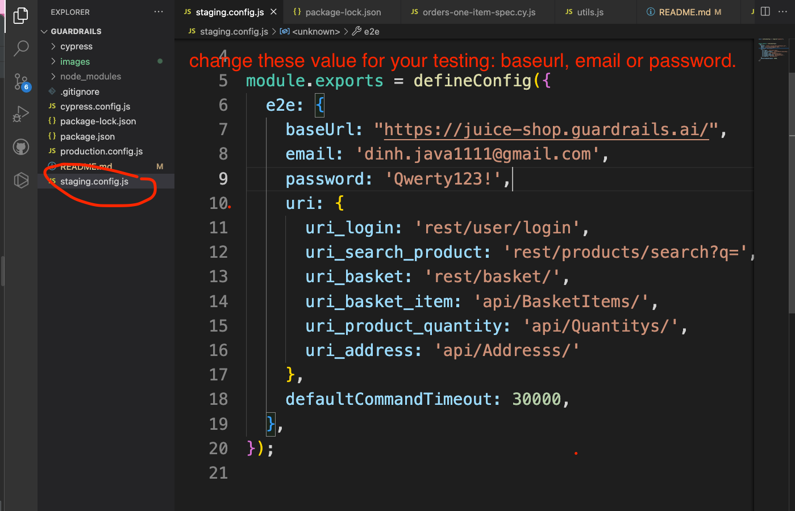

note: there is a default config.js: cypress.config.js. this file is used for default testing.
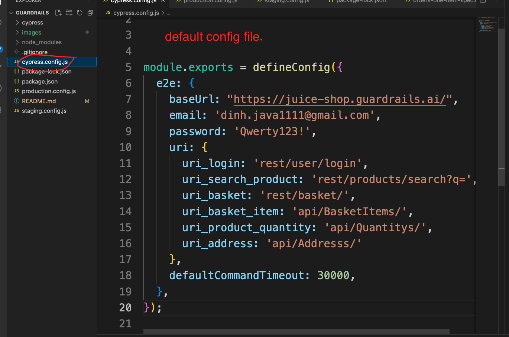

# IV. Run Test case
## 1. Install dependencies before running test.
After you clone your project to your local. Under the root folder /guardrails/ you will see a file called "package.json". This file will contain all dependencies for your testing project.
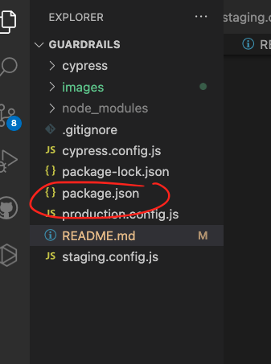

Open terminal and run the command: npm install --save-dev
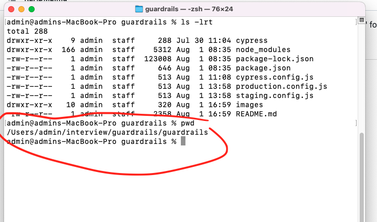

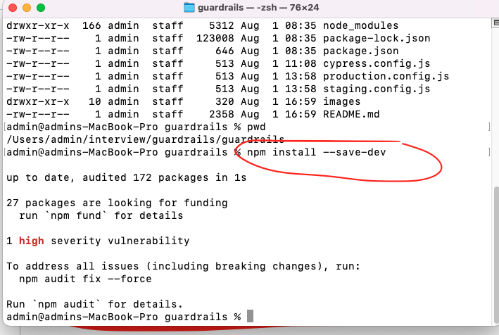

after you install dependencies you can run the test case.

Before running test case, if you want to modify your test data like :
+ email login
+ password login
+ baseUrl
+ or uri request
you should go to configuration file to update as i mentions in section III.

## 2. How to run test case.
open the terminal and go to root folder

use this command to run test case: npx cypress run --env configFile=<configuration env file> <location of test case>

ex: if i want to run all the test cases on staging env i will use like this: npx cypress run --env configFile=staging.config.js cypress/e2e/

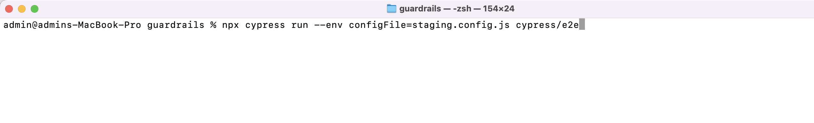
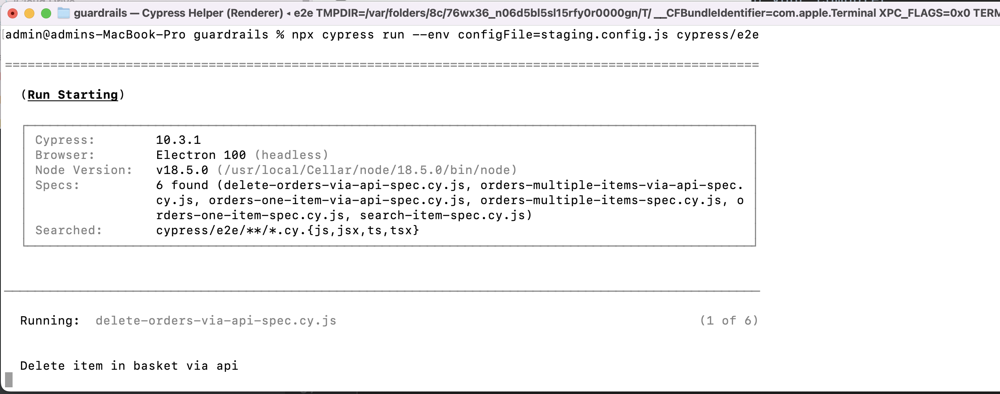

ex: if i want to run all the test cases on production env i will use like this: npx cypress run --env configFile=production.config.js cypress/e2e/

ex: if i want to run only the api test cases on production env i will use like this: npx cypress run --env configFile=production.config.js cypress/e2e/api

ex: if i want to run only the fe test cases on production env i will use like this: npx cypress run --env configFile=production.config.js cypress/e2e/fe
